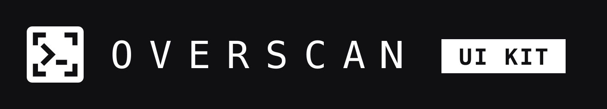
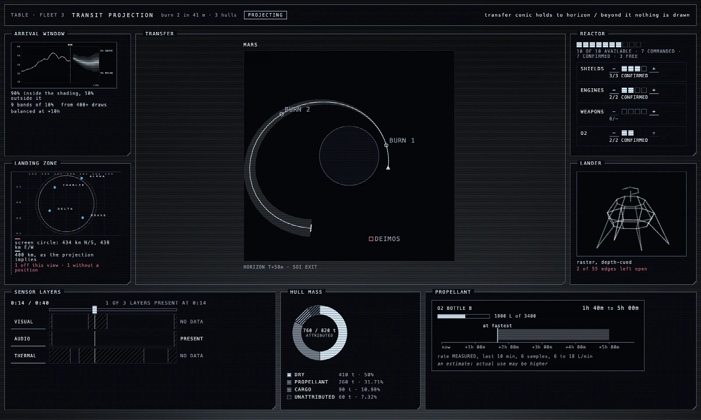
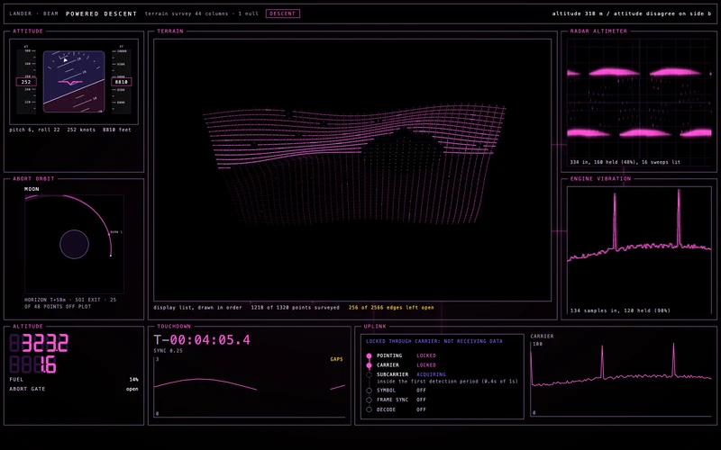
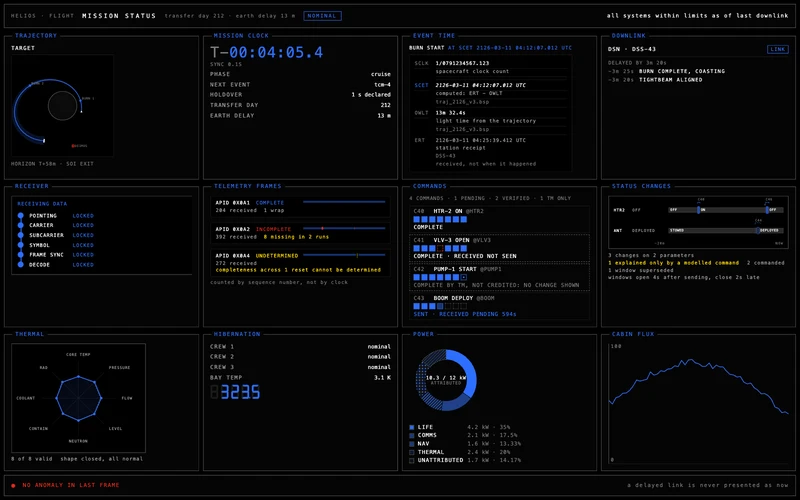
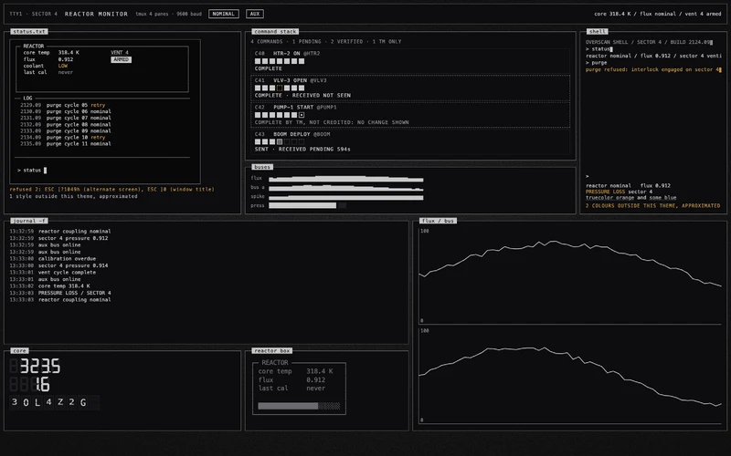

<h1></h1>

**Sci-fi screens that actually work.**

The screens in science-fiction films are motion graphics: beautiful, and
showing nothing real. Overscan is that look, built like a real instrument.
Custom elements and a CSS layer for control panels, dashboards and telemetry,
ten dark themes, no build step required.

Real instruments say "no reading" instead of making one up, mark a value that
is old or typed in by hand, and draw the thing they measure. So do these.

<a href="https://overscan.dev/screens/holo"></a>

<p>
<a href="https://overscan.dev/screens/vector"></a>
<a href="https://overscan.dev/screens/antiseptic"></a>
<a href="https://overscan.dev/screens/terminal"></a>
</p>

Every screen is built from kit elements only. All ten are at
[overscan.dev/screens](https://overscan.dev/screens).

## Install

With a bundler:

```
npm i overscan
```

With a script tag, no install and no bundler:

```html
<link rel="stylesheet"
      href="https://cdn.jsdelivr.net/npm/overscan/src/overscan.css">
<script type="module"
        src="https://cdn.jsdelivr.net/npm/overscan/src/overscan.js"></script>
```

No bare specifier ships in the source, so a browser resolves every element from
that one URL. It is the whole kit, one request per module: point it at
`src/ov-chart.js` instead to take a single element. It must be
`type="module"`; a classic script tag will not load it.

## Use it

Any element can be imported on its own, which is the smallest thing that works:

```js
import "overscan/chart";
import "overscan/overscan.css";
```

```html
<ov-chart values="41,43,44,46,48"></ov-chart>
```

The element keeps the `ov-` prefix, because that is its name in the DOM and a
custom element name must contain a hyphen. The import does not: inside a
package called `overscan`, the prefix says nothing the specifier has not said
already. `overscan/chart.js` and `overscan/ov-chart.js` both work too, for
anyone typing what they see in a file listing.

### Without a build step

An import map resolves the same elements in a browser with no bundler. Use the
file's real name here: an import map cannot do what `exports` does. A map key
ending in `/` has to map to an address ending in `/`, so a prefix cannot supply
the `ov-`, and nothing in a map can supply the `.js`.

```html
<script type="importmap">
{ "imports": { "overscan/": "/node_modules/overscan/src/" } }
</script>
<script type="module">
  import "overscan/ov-chart.js";
</script>
```

Or take the whole kit in one import:

```js
import "overscan";
```

That is every element and every helper, each its own module. A bundler folds
them into one file, but with no build step it is one request per module, so a
page that uses three instruments should import three. The CSS has no per-element split yet:
link `overscan/overscan.css` whichever route you take. It is one file of
`@import`s that the browser caches once, and loading only part of it is not
supported until something proves each element renders the same that way.

The one exception is the media player. Its styles are 9 KB that a page without
a player should not load, so they are not in `overscan.css`, and a page with
`<ov-player>` imports them as well:

```js
import "overscan/overscan.css";
import "overscan/src/player.css";
import "overscan/src/player-icons.css";
```

Every import registers a custom element as a side effect, which is why this
package lists every element module and stylesheet under `sideEffects`. A
bundler told otherwise will tree-shake the kit away and leave a page of tags
that never upgrade. The framework wrappers are the exception: each component
imports only its own element, so in a production build a wrapper you never
import costs nothing.

No framework is required. React, Vue and Svelte wrappers are generated from the
same manifest and shipped alongside:

```js
import { OvChart } from "overscan/react";
```

TypeScript definitions are included.

## Themes

Themes are token sets, applied with one attribute on any ancestor:

```html
<div data-ov-theme="terminal">…</div>
```

Ten dark themes ship: terminal, industrial, cyber, antiseptic, esper, neo,
machina, holo, aegis and vector. They differ in more than colour: type,
furniture, bevel depth, alarm hue and the shader field behind them.

## Density

The other kit-wide attribute, set the same way, on any ancestor.

**An instrument shows its visual content and nothing else, by default** — the
face, the reading, the unit that reading is in, and anything it is refusing or
qualifying. What it does not show is the supporting prose: the element's own
name, the footnote restating the rules it is judging by, the hint line. A wall
writes the name and the rules once above twenty instruments, and twenty
instruments repeating them is noise rather than rigour.

To opt back in, for a single instrument on a page of its own where there is no
wall to carry the name:

```html
<div data-ov-chrome="full">…</div>
```

`data-ov-chrome="bare"` is that default said out loud. It is worth having a
word for because it nests: put it inside a `full` region to return one
instrument to dense.

It is a density control and nothing more. **It never hides a refusal, a
qualifier, a reading or the unit that reading is in**, and it does not touch
what an element says in its accessible name, so a screen reader gets the
identical sentence either way — a hidden name is still a spoken name.

The line is *measured versus declared*, not number versus word. `±1.5`,
`RED AT 3`, `MARGIN 0.50 nm` and `EXPIRES 30m 00s` are all hidden by default,
and every one of them is an author-set attribute: what the instrument was told
to do. What is never hidden is what it measured.

It is pure CSS with no JavaScript behind it, which is why it does not appear in
`custom-elements.json`: nothing reads it off an element.

## Readouts refuse to invent

Hand a widget a value it cannot draw and it renders a refusal, never a
different number. A seven-segment display given six digits of room and seven
digits of number does not truncate or scroll: it refuses, and says why. A value
that arrived too long ago is drawn with its age. A reading entered by hand is
marked as entered by hand, however plausible it looks.

The kit has one shared protocol for this, so the behaviour is the same in every
element rather than reinvented per widget:

- **Refusals** withhold the number, because showing one would be a lie:
  `unknown`, `out-of-range`, `overflow`, `unrepresentable`, `other-frame`.
- **Qualifiers** show the number and say something true about it, because
  withholding it would also be a lie: `stale`, `frozen`, `substituted`,
  `uncal`, `clamped`, `disputed`.

Every refusal and qualifier is written into the element's accessible name as
well as drawn, and no state is carried by colour alone.

## Requirements

Modern browsers with custom elements, ES modules and CSS nesting. No
dependencies.

GSAP is optional. Only `ov-flip` and `ov-reveal` use it, they read it from
`window.gsap` rather than importing it, and without it they say `gsap not
loaded` instead of pretending to animate. If you load it, its size is on top of
the kit's.

The WebGL elements borrow from a pool of twelve contexts, lent to whatever is on
screen and taken back when it leaves, because a browser silently evicts contexts
past about sixteen.

MIT.
